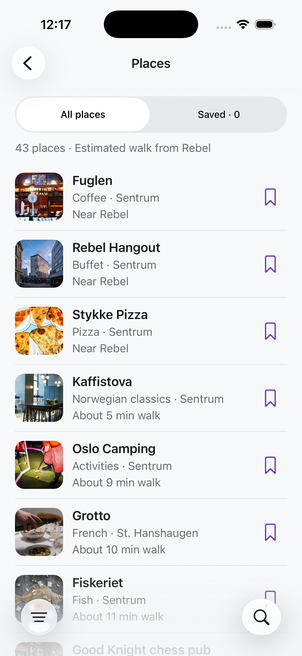
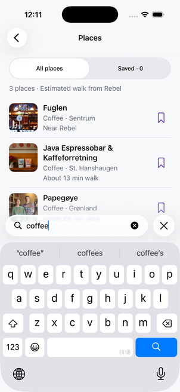
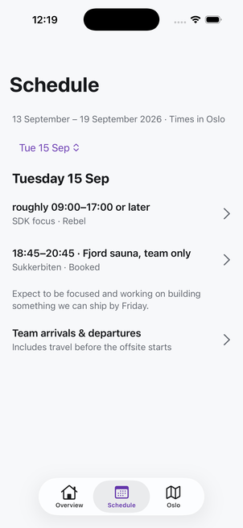
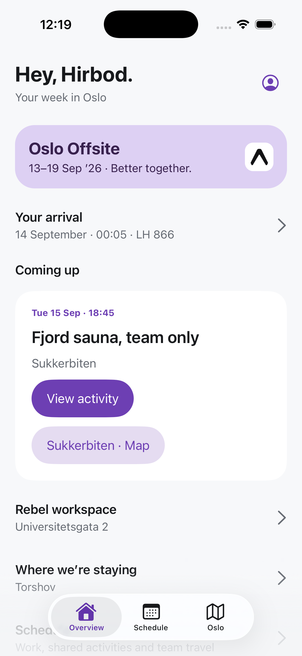
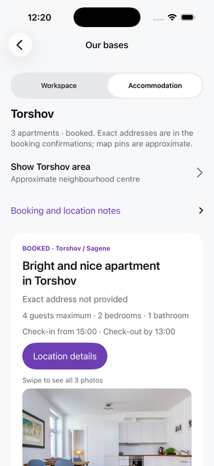
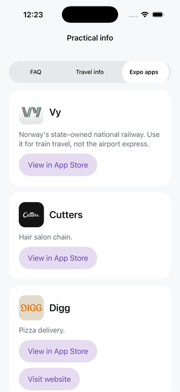
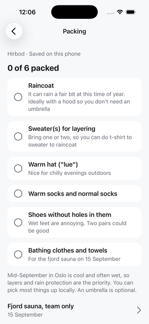
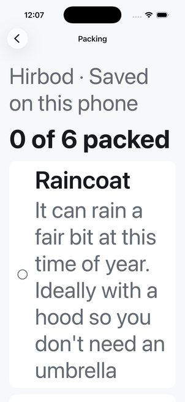
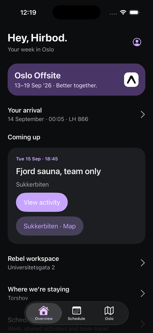

# iOS design changes

Implemented 9 September 2026 from the [design review](DESIGN-REVIEW-IOS.md), using the Apple design skill and the installed Expo SDK 58 canary APIs. The user authorized installed APIs after the required versioned documentation URL returned 404. Official references: [Expo Router](https://docs.expo.dev/versions/unversioned/sdk/router/) and [Expo UI](https://docs.expo.dev/versions/unversioned/sdk/ui/).

| Area | Result |
| --- | --- |
| Places | Expo Router's native search button displays a magnifying glass in the bottom toolbar. It expands into a search field above the keyboard. Results and counts remain visible while typing. Category and walking origin live in a native filter menu. |
| Browsing and saving | Continuous compact rows replace paginated photo cards. Each row opens its detail and has a separate 44-point bookmark. All/Saved modes and actionable empty states remain visible. |
| Text and controls | Shared iOS text uses semantic Dynamic Type roles. Navigation and completion rows grow with their text. Short choices use segmented controls, switching to menus at accessibility text sizes. |
| Schedule | Date sections contain compact work and activity rows with times and locations. Tuesday's work and sauna fit together on screen. Initial selection uses today in Oslo during the offsite and All days outside it. |
| Overview | A compact event banner leaves room for arrival, the next activity, workspace and accommodation. Travel advances from arrival to departure and then the full trip. Navigation labels match the tabs. Decorative branding yields space at larger text sizes. |
| Packing and identity | Packing uses completion circles and full-row taps. Attendee selection exposes selected state. Profile is named “Your profile”; back navigation has meaningful destinations. |
| Details | Maps precede photos and websites. Accommodation capacity and check-in are visible sooner. Booking, itinerary and location provenance expand on demand; approximate-location and ticket-check notices remain visible. |
| Practical | FAQ, travel information and Expo apps use visible segments. App icons sit beside their names in shorter cards. |

Android and web use the same content hierarchy with platform-specific control fallbacks. No dependencies were upgraded for this pass.

## Screenshots

| Places | Native search | Schedule |
| --- | --- | --- |
|  |  |  |

| Overview | Accommodation | App directory |
| --- | --- | --- |
|  |  |  |

| Packing at default size | Packing at largest accessibility size | Dark appearance |
| --- | --- | --- |
|  |  |  |

## Validation

- TypeScript, lint, and whitespace checks passed; 53 automated tests passed. Time tests cover Oslo midnight, daylight saving, event boundaries, and arrival/departure transitions.
- Web production export passed with 22 static routes. Android production export passed. These are bundling checks, not Android device validation.
- Live iPhone 17 Pro on iOS 26.5: native search, no-match recovery, category filtering, saving/removing a place, Saved empty-state recovery, place-to-map navigation, Tuesday selection and activity navigation, accommodation and approximate map notices, itinerary disclosure, attendee selection display, and Practical modes.
- Packing was checked at default and largest accessibility sizes, including toggle and undo. Overview was checked at both sizes and in dark appearance. A before/after screenshot comparison confirmed the intended overview hierarchy change.
- Simulator text size and light appearance were restored. The attendee and personal lists were restored to their starting values.

Smaller iPhones, Android device layouts, spoken VoiceOver navigation, and physical touch/motion testing still need a dedicated validation pass. Accessibility-tree inspection is not a substitute for VoiceOver testing.

## Search replay

Flow: [ios-places-search-design.yaml](../.argent/flows/ios-places-search-design.yaml). Two complete replays passed; each reported 11 passed, 0 failed, 0 errored, 0 skipped, plus three explanatory checkpoints.

Prerequisite: iOS 26 or later, app open on Places, All places, All categories, walking from Rebel, default text size, empty query and closed search. Any attendee can be selected. The flow opens search, checks a no-match state, clears it, searches for coffee, and closes search. It leaves the query empty and personal lists unchanged.

```sh
argent flow run ios-places-search-design --platform ios --device <IOS_UDID>
```

There are no coordinate or raw-gesture exceptions. SwiftUI result checks intentionally use Argent accessibility-tree waits because those controls are absent from its UIView selector projection. Keyboard steps preserve native search focus.
